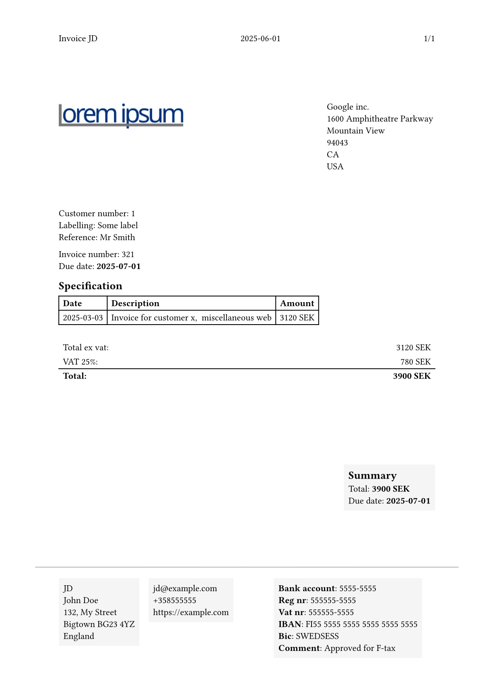

# PTA Typst Invoice

WIP invoice for use with PTA software like [Tackler](https://tackler.fi/).

## PTA
Read more about [PTA - Plain Text Accounting](https://plaintextaccounting.org/).
Hopefully in the future this invoice will work with all PTA software that exports json. 

## Details
The invoice reads from .toml and .json files.
- clients.toml
- static_data.toml
- a json file containing the transaction data, the file name is specified in static_data.toml

## Preview

## Disclaimer
The invoice may not fullfill all legal requirements
